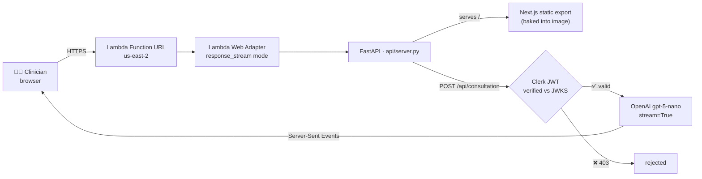
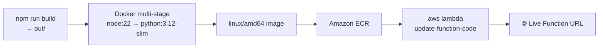

<div align="center">

# 🩺 MediNotes Pro

### Turn messy consultation notes into a chart summary, a follow-up checklist and a patient-ready email — streamed live.

[](https://55ncfzx5whditvl2364jsjk3gy0twvlw.lambda-url.us-east-2.on.aws/)
[](https://aws.amazon.com/lambda/)
[](https://nextjs.org/)
[](https://fastapi.tiangolo.com/)


**🔗 https://55ncfzx5whditvl2364jsjk3gy0twvlw.lambda-url.us-east-2.on.aws/**

</div>

---

## 💡 What it does

A clinician pastes the shorthand they typed during a visit. One request later, three finished pieces of work stream back — token by token, no spinner:

| Section | What it is |
|---|---|
| 📋 **Summary of visit** | A structured record entry — history, findings, assessment — in the order a chart expects |
| ✅ **Next steps** | Follow-ups, referrals, labs and medication changes pulled out as an actionable checklist |
| ✉️ **Patient email** | The same visit rewritten at a reading level patients actually use |

Each section renders in its own card with its own **copy button**, so the chart entry goes to the chart and the email goes to the mail client — without dragging the other two along.

```text
55M, 3/7 productive cough, no fever. Ex-smoker, 20 pack years.
O/E chest clear, sats 97% RA, BP 148/92.
Rx amoxicillin 500mg tds 5/7. Repeat BP in 2/52, safety-net advice given.
```
⬇️ *becomes three reviewed-and-ready drafts in about twenty seconds.*

---

## 🏗️ Architecture

One container serves the whole product — static frontend **and** streaming API — behind a single Lambda Function URL.



**Build & ship pipeline**



### The three decisions that shaped it

1. **Static export + FastAPI, not two deployments.** `output: 'export'` compiles the Next app to plain HTML/JS, which the Python container serves at `/`. One image, one URL, no CORS, no second bill.
2. **Lambda Web Adapter in `response_stream` mode.** Without it, Lambda buffers the whole response and "streaming" text arrives in one lump at the end. With it, SSE flows through untouched and the UI fills in live.
3. **Auth at the edge of the model call.** The JWT is verified against Clerk's JWKS *before* a single token is spent, and `<Protect plan="premium_subscription">` gates the UI. Try `POST /api/consultation` without a token and you get a `403`.

---

## 🧰 Tech stack

| Layer | Choice | Why |
|---|---|---|
| Frontend | Next.js 16 (Pages Router), React 19, TypeScript | Static export → cacheable, cheap, no SSR runtime to operate |
| Styling | Tailwind v4 with CSS-variable design tokens | One palette drives light **and** dark mode; no config file |
| Streaming | `@microsoft/fetch-event-source` | SSE over `POST` (the native `EventSource` is GET-only) |
| Backend | FastAPI + Uvicorn | Async streaming responses in a handful of lines |
| Model | OpenAI `gpt-5-nano` with `stream=True` | Fast and cheap enough for per-visit use |
| Auth & billing | Clerk (JWT + `PricingTable`) | Sign-in, subscription gating and JWKS verification out of the box |
| Runtime | Docker → Amazon ECR → AWS Lambda (container image) | Scales to zero; you pay per consultation, not per hour |

---

## 🚀 Run it locally

```bash
# 1. Frontend
npm install
npm run dev                  # UI at :3000 (API not attached in this mode)

# 2. Full app, the way production runs it
docker build --build-arg NEXT_PUBLIC_CLERK_PUBLISHABLE_KEY="$NEXT_PUBLIC_CLERK_PUBLISHABLE_KEY" \
  -t consultation-app .
docker run -p 8000:8000 \
  -e CLERK_SECRET_KEY="$CLERK_SECRET_KEY" \
  -e CLERK_JWKS_URL="$CLERK_JWKS_URL" \
  -e OPENAI_API_KEY="$OPENAI_API_KEY" \
  consultation-app           # → http://localhost:8000
```

### Deploy an update

```bash
aws ecr get-login-password --region $DEFAULT_AWS_REGION | docker login --username AWS \
  --password-stdin $AWS_ACCOUNT_ID.dkr.ecr.$DEFAULT_AWS_REGION.amazonaws.com

docker build --platform linux/amd64 --provenance=false \
  --build-arg NEXT_PUBLIC_CLERK_PUBLISHABLE_KEY="$NEXT_PUBLIC_CLERK_PUBLISHABLE_KEY" \
  -t consultation-app .

docker tag consultation-app:latest $AWS_ACCOUNT_ID.dkr.ecr.$DEFAULT_AWS_REGION.amazonaws.com/consultation-app:latest
docker push $AWS_ACCOUNT_ID.dkr.ecr.$DEFAULT_AWS_REGION.amazonaws.com/consultation-app:latest

aws lambda update-function-code --function-name consultation-app \
  --image-uri $AWS_ACCOUNT_ID.dkr.ecr.$DEFAULT_AWS_REGION.amazonaws.com/consultation-app:latest \
  --region $DEFAULT_AWS_REGION
```

> 🍎 On Apple Silicon, `--platform linux/amd64 --provenance=false` is mandatory — Lambda rejects both arm64 images and the provenance manifest.

### Environment variables

| Variable | Where it's needed |
|---|---|
| `NEXT_PUBLIC_CLERK_PUBLISHABLE_KEY` | **Build time** — baked into the static export, so changing it means rebuilding the image |
| `CLERK_SECRET_KEY` · `CLERK_JWKS_URL` | Runtime — JWT verification |
| `OPENAI_API_KEY` | Runtime — model calls |
| `AWS_ACCOUNT_ID` · `DEFAULT_AWS_REGION` | ECR / Lambda commands |

---

## 🧗 Three things that bit, and the fix

| Symptom | Cause | Fix |
|---|---|---|
| Streaming arrived as one lump at the end | Lambda buffers responses by default | `ENV AWS_LWA_INVOKE_MODE=response_stream` + the Web Adapter extension |
| Markdown collapsed into a single paragraph | SSE strips newlines from the payload | Re-encode each newline as `data:  \n`, decode with `remark-breaks` |
| Image pushed fine, Lambda refused it | Built on arm64 with a provenance manifest | `--platform linux/amd64 --provenance=false` |

---

## ⚠️ Disclaimer

A course/demonstration project — **not a medical device and not for clinical use.** Every output is a draft for a clinician to read, edit and sign off; nothing is sent to a patient automatically, and the app writes no notes to any database.

<div align="center">

**Built as part of [AI in Production](https://github.com/SaiSatyaJagannadh/AI-Production)** · deployed on AWS Lambda 🚀

</div>
