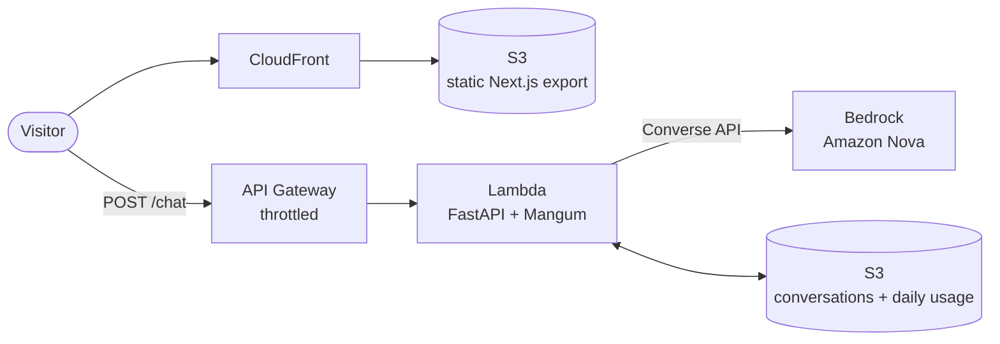

<div align="center">

# 🤖 Digital Twin

### An AI version of me that answers recruiters' questions about my background, projects and the roles I'm looking for, deployed to AWS with Terraform in one command.

[](https://do2s1pa4farox.cloudfront.net)
[](terraform/main.tf)
[](https://aws.amazon.com/bedrock/)


**🔗 https://do2s1pa4farox.cloudfront.net**

</div>

---

## 💡 What it does

Visitors chat with my twin as if they were messaging me. It answers in my voice, using my real background rather than generic filler.

| | |
|---|---|
| 🧠 **Grounded persona** | The system prompt is built from my LinkedIn PDF, a summary, a style guide and a facts file in [`backend/data/`](backend/data/). Changing the twin means editing those files, not the code |
| 💬 **Remembers the conversation** | Every chat is saved to S3, so refreshing the page brings the thread back |
| 📝 **Readable answers** | Replies render as markdown. Anything a visitor types stays plain text |
| 🛡️ **Usage limits** | 3 messages per visitor per day, 50 site-wide, plus API Gateway throttling, so a public link can't run up the Bedrock bill |

---

## 🏗️ Architecture

The frontend and the API deploy separately. A static site sits on CloudFront, and a serverless API runs behind API Gateway.



| Layer | Choice | Why |
|---|---|---|
| Frontend | Next.js App Router, static export → S3 + CloudFront | No server to run, HTTPS and caching at the edge |
| API | FastAPI on Lambda via Mangum, HTTP API Gateway | Scales to zero, so it costs nothing while nobody is chatting |
| Model | AWS Bedrock (Nova Micro in dev, Nova Lite in prod) | Stays inside AWS: IAM instead of an API key, no extra vendor |
| Memory | One JSON object per session in a private S3 bucket | Durable and cheap, and needs no database |
| Infra | Terraform with `dev` / `test` / `prod` workspaces | The whole stack is reproducible, and each environment is isolated |

---

## 🚀 What I built on top of the course

- **One-command deploy and teardown.** [`scripts/deploy.sh`](scripts/deploy.sh) builds the Lambda zip, runs `terraform apply`, writes the API URL into the frontend build and syncs it to S3. [`scripts/destroy.sh`](scripts/destroy.sh) empties the buckets and destroys the stack.
- **Environments as Terraform workspaces.** `./scripts/deploy.sh prod` uses `prod.tfvars`, which selects a stronger model, higher throttle limits and an optional custom domain with ACM + Route 53.
- **Lambda-compatible builds from a Mac.** [`backend/deploy.py`](backend/deploy.py) installs dependencies inside the official Lambda Python 3.12 image, so the zip contains Linux x86_64 wheels rather than macOS arm64 ones (~30 MB, under Lambda's 50 MB upload limit).
- **Demo guardrails.** Each browser gets a visitor id that survives "New chat". The backend enforces the daily allowance and returns a clear `429`, and the UI shows a live "N messages left today" countdown.
- **A polished chat UI.** It has starter questions, copy buttons on replies, auto-scroll that doesn't interrupt you when you scroll back, a cold-start/offline banner and retry on failure.

## 🐛 Bugs that only appeared in production

| Symptom | Cause | Fix |
|---|---|---|
| The deployed twin gave vague, generic answers | Lambda's filesystem is case-sensitive: the file is `Linkedin.pdf`, but the code asked for `linkedin.pdf` | Case-insensitive lookup, paths resolved from `__file__` |
| The deploy succeeded, but the site talked to an old API | Next.js ranks `.env.local` above the `.env.production` that `deploy.sh` writes | Remove `.env.local` and check the built bundle before syncing |
| `terraform init` timed out loading the AWS provider | Intel Terraform under Rosetta pulled the amd64 provider on Apple Silicon | Native arm64 Terraform from `hashicorp/tap` |
| The local frontend failed against the deployed API while `curl` worked | CORS allows only the CloudFront origin, and curl doesn't enforce CORS | Add `localhost` to `CORS_ORIGINS` when developing against the cloud |

---

## 🛠️ Run it locally

```bash
# terminal 1 — API on :8000 (needs AWS credentials with Bedrock access)
cd backend && uv sync && uv run uvicorn server:app --reload --port 8000

# terminal 2 — UI on :3000 (no .env.local = talks to localhost:8000)
cd frontend && npm install && npm run dev
```

## ☁️ Deploy

```bash
./scripts/deploy.sh dev      # dev | test | prod
./scripts/destroy.sh dev
```

After a frontend sync, invalidate CloudFront (`aws cloudfront create-invalidation --distribution-id <id> --paths "/*"`) so visitors get the new bundle.

| Setting | Default | Where |
|---|---|---|
| `MESSAGES_PER_USER` | 3 | Lambda env var |
| `MESSAGES_PER_DAY` | 50 | Lambda env var |
| `BEDROCK_MODEL_ID` | `amazon.nova-micro-v1:0` | `terraform/terraform.tfvars` |
| API throttle | 5 rps, burst 10 | `terraform/terraform.tfvars` |

> Terraform manages the Lambda's environment, so a limit changed in the console is reset on the next `terraform apply`. To keep it, add it to the `environment` block in [`terraform/main.tf`](terraform/main.tf).

⚠️ An AI twin can get things wrong. It's a portfolio demo, not a substitute for talking to me.
